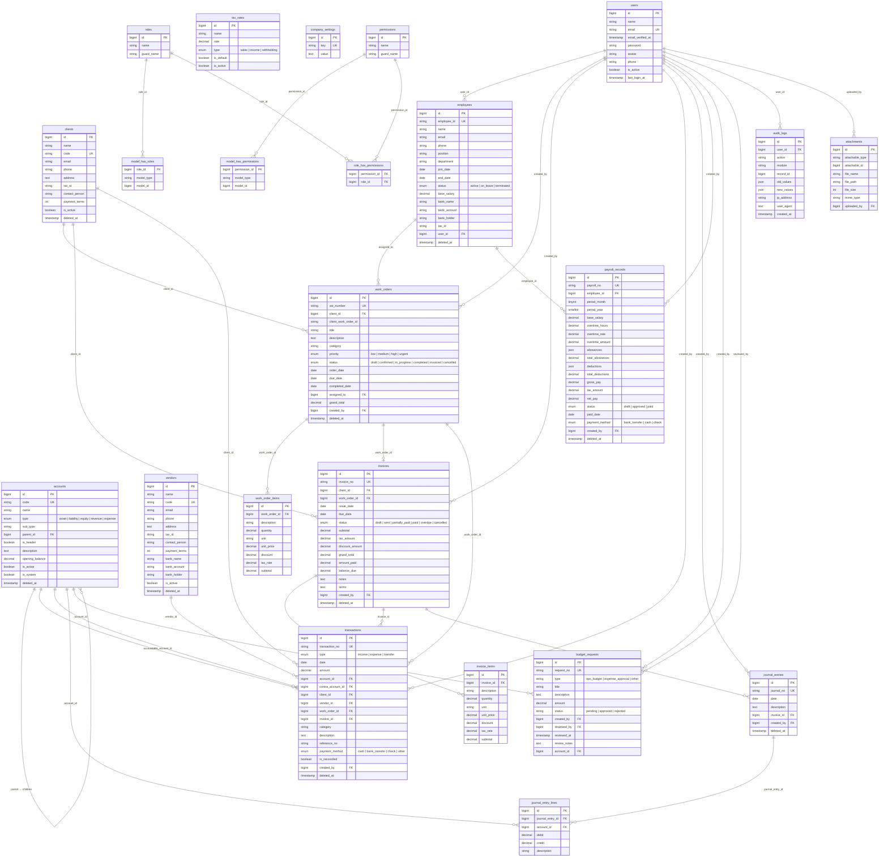

# Kucatat — Catat, Kelola, Tumbuh.

Kucatat adalah aplikasi pencatatan keuangan untuk UKM. Kelola work order, catat transaksi, atur payroll karyawan, dan buat laporan keuangan — semua dalam satu platform.

## Tech Stack

| Layer | Technology |
|-------|-----------|
| Backend | Laravel 12 (PHP 8.3+) |
| Frontend | Laravel Blade + Livewire 3 + Alpine.js |
| Database | SQLite (dev) / PostgreSQL (production) |
| Auth | Session-based (Laravel default) |
| UI | Tailwind CSS v4 |
| Charts | Chart.js (via Alpine.js) |
| PDF | DomPDF |

> **Migration note:** The app was migrated from a split Next.js + Laravel API architecture to a single Laravel monolith using Blade + Livewire. The `frontend/` directory is preserved but no longer served. The existing JSON API at `/api/v1` is kept for backward compatibility (e.g. mobile apps).

## Getting Started

### Prerequisites

- PHP 8.3+
- Composer
- Node.js 20+
- npm

### Setup

```bash
cd backend
composer install
cp .env.example .env
php artisan key:generate
php artisan migrate --seed
npm install
npm run build
php artisan serve
```

The app runs at `http://localhost:8000`.

### Default Login

- **Email:** admin@example.com
- **Password:** password

## Modules

### Work Order Management
- Record and track service requests from client companies
- Line item pricing with tax and discount calculations
- Status workflow: Draft → Confirmed → In Progress → Completed → Invoiced
- Convert work orders to invoices

### Client & Vendor Management
- Client (customer) directory with contact details and payment terms
- Vendor (supplier) directory with banking information

### Financial Transactions
- Record income, expenses, and transfers
- Double-entry bookkeeping with contra accounts
- Payment method tracking
- Transaction summary by type and period

### Invoice Management
- Generate invoices with line item pricing, tax, and discounts
- Record partial and full payments
- Automatic overdue tracking
- PDF generation

### Chart of Accounts
- Hierarchical account structure (Assets, Liabilities, Equity, Revenue, Expenses)
- Default chart of accounts seeded on setup

### Journal Entries
- Manual double-entry journal postings
- Debit/credit balance validation

### Employee & Payroll
- Employee directory with personal, employment, and banking details
- Monthly payroll generation
- Overtime, allowances, and deductions
- Approval workflow: Draft → Approved → Paid
- Payslip PDF generation

### Tax Management
- Configurable tax rates (Sales, Income, Withholding)
- Tax summary reporting

### Financial Reports
- Profit & Loss Statement
- Balance Sheet
- Cash Flow Statement
- Trial Balance
- General Ledger
- Accounts Receivable Aging
- Income by Client
- Expense by Category
- Work Order Summary
- Payroll Summary
- Tax Summary

### User Management
- Role-based access control (Super Admin, Admin, Accountant, Viewer)
- Granular permissions per module
- Audit trail with full change history

### Dashboard
- Revenue, expenses, and net profit (MTD)
- Cash balance and outstanding receivables
- Revenue vs expense chart
- Work order pipeline
- Recent transactions

## Database Schema



### Key Design Decisions

| Aspect | Details |
|--------|---------|
| **Bookkeeping** | Double-entry: every `transaction` records `account_id` (debit) and `contra_account_id` (credit) |
| **Chart of Accounts** | Self-referencing `parent_id` enables hierarchical account tree |
| **Soft Deletes** | `accounts`, `clients`, `vendors`, `employees`, `work_orders`, `invoices`, `transactions`, `journal_entries`, `payroll_records` |
| **Polymorphic** | `attachments` uses `attachable_type` / `attachable_id` morphs; `personal_access_tokens` uses `tokenable` morphs |
| **RBAC** | Spatie Permission — `roles`, `permissions`, and three pivot tables |
| **Audit Trail** | `audit_logs` stores JSON diffs (`old_values` / `new_values`) per module action |
| **Enums** | Status and type fields use database-level enums for data integrity |

## API

The backend preserves a RESTful JSON API at `/api/v1` with Sanctum token-based auth for backward compatibility. See `docs/PRD.md` for full API documentation.

## Project Structure

```
kucatat/
├── backend/                 # Laravel monolith (web + API)
│   ├── app/
│   │   ├── Http/Controllers/
│   │   │   ├── Api/V1/            # Existing JSON API controllers (preserved)
│   │   │   └── Auth/              # Web auth (LoginController)
│   │   ├── Livewire/              # Livewire components (all modules)
│   │   ├── Helpers/               # Format helper (currency, date)
│   │   ├── Models/                # Eloquent models
│   │   └── Traits/                # Shared traits
│   ├── database/
│   │   ├── migrations/            # Database schema
│   │   └── seeders/               # Default data
│   ├── resources/
│   │   ├── views/
│   │   │   ├── layouts/           # app.blade.php + guest.blade.php
│   │   │   ├── components/        # Blade UI components (icon, stat-card, badge, etc.)
│   │   │   ├── livewire/          # Livewire view templates (all modules)
│   │   │   ├── auth/              # login.blade.php
│   │   │   └── pdf/               # PDF templates (DomPDF)
│   │   ├── css/app.css            # Tailwind CSS v4 + design tokens
│   │   ├── js/app.js              # Alpine.js + Chart.js setup
│   │   └── lang/id.json           # Bahasa Indonesia strings
│   └── routes/
│       ├── web.php                # Web routes (Blade/Livewire)
│       └── api.php                # JSON API routes (preserved)
├── frontend/                # Next.js SPA (archived, no longer served)
└── docs/
    └── PRD.md                     # Product Requirements Document
```
